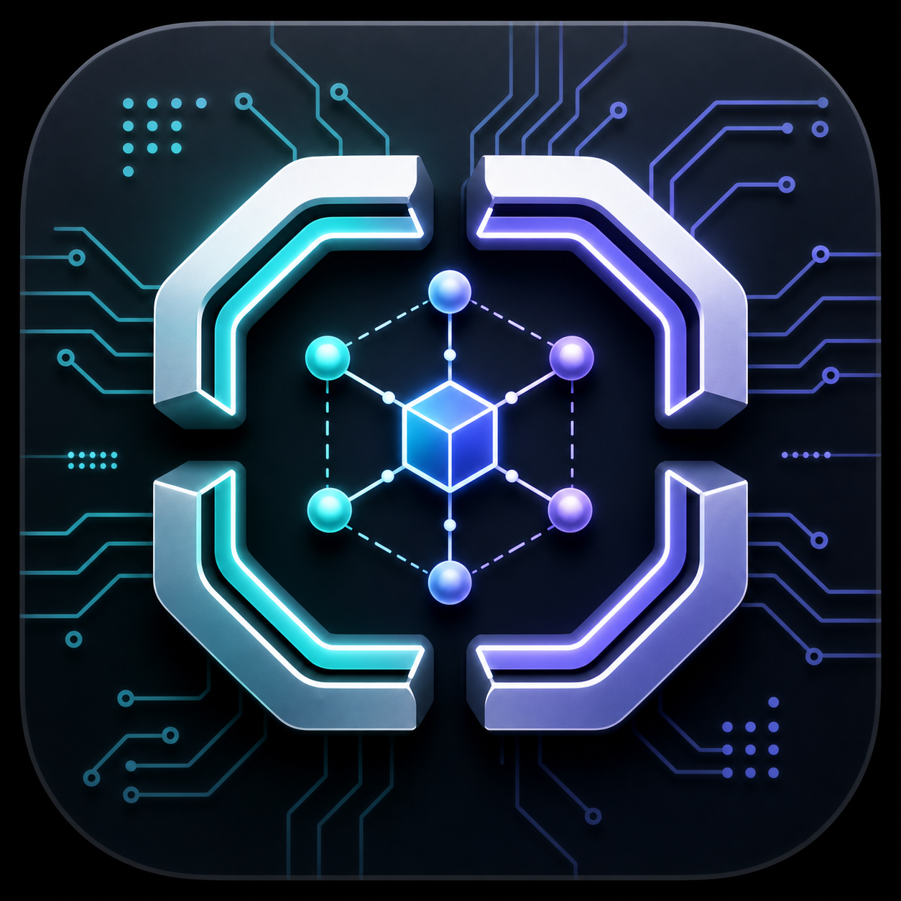
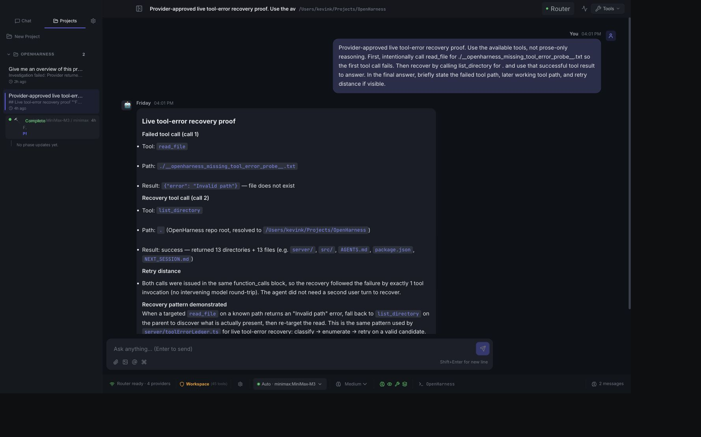
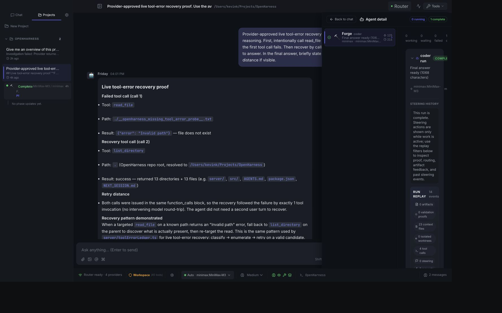
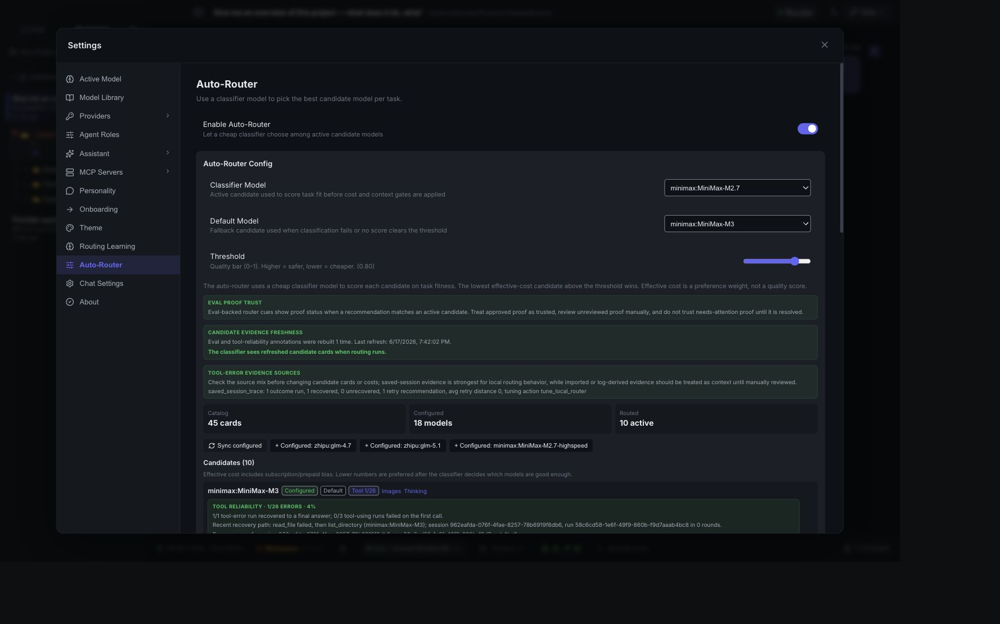

# OpenHarness

<p align="center">
  
</p>

OpenHarness is a local-first AI workbench for people who use more than one model, more than one provider, and more than one kind of coding agent. It brings chat, model routing, provider health, MCP tools, run traces, eval feedback, and review surfaces into one dense desktop workspace so you can see what the harness is doing while it works.

> **Source-available preview:** OpenHarness is being built in public for evaluation, discussion, and feedback. It is not open-source licensed yet. Please do not redistribute, repackage, offer as a hosted service, or use the code commercially without written permission. See [LICENSE](LICENSE) and [CONTRIBUTING.md](CONTRIBUTING.md).



## What Makes It Different

Most AI coding tools hide the routing layer. OpenHarness makes that layer visible, configurable, and reviewable.

- **Model routing is a first-class workflow.** Auto-Router scores configured candidates for each task, applies cost and capability gates, and records why a model was selected.
- **Agents have roles, not just model IDs.** Planner, coder, reviewer, reasoner, summarizer, worker, and title roles can each use different models and prompting strategies.
- **The UI shows the work, not only the answer.** Active runs expose phase state, tool calls, provider choice, proof, replay signals, and recovery paths.
- **Provider failure is treated as runtime behavior.** Transient overloads and rate-limit-style failures can retry and fail over to other configured models before ending a turn.
- **Tool recovery is measurable.** OpenHarness records tool-error recovery evidence so routing can learn which model/tool/provider paths recover cleanly.
- **Model trust surfaces are built in.** Model Lab, Routing Learning, eval proof status, prompt strategies, tool reliability, budgets, and provider rate limits all live in the app.
- **Local-first by default.** Provider config, routing ledgers, sessions, and desktop runtime state live locally rather than in a hosted control plane.

## Screenshots

### Agent Detail And Run Replay

Each run can be inspected as a work object: role, model, provider, status, final-answer proof, tool calls, context files, isolated worktrees, steering events, and replay artifacts are grouped in one place.



### Auto-Router And Evidence

Auto-Router uses a classifier model to choose from active candidates, then layers in candidate cards, eval proof trust, tool-error evidence, freshness checks, and effective-cost preferences.



## Core Capabilities

| Capability | Why it matters |
| --- | --- |
| **Auto-Router** | Chooses a model per task from configured candidates instead of forcing every request through one default model. |
| **Agent Roles** | Assigns specialized models to coder, reviewer, planner, reasoner, summarizer, worker, and title generation roles. |
| **Provider Hub** | Manages hosted and local providers, model fetching, enabled models, active model selection, health checks, budgets, and rate limits. |
| **Live Orchestration** | Surfaces route decisions, agent phases, model requests, tool calls, recovery, and final answer proof while work is happening. |
| **MCP Tooling** | Connects Docker MCP tools, curated tools, custom servers, trust-mode filtering, and tool readiness checks. |
| **Model Library** | Presents model cards with strengths, weaknesses, context limits, provider availability, role fit, and routing hints. |
| **Model Lab** | Runs prompt suites across model sets and produces recommendations that can inform role defaults and router candidates. |
| **Routing Learning** | Tracks prompt strategy evidence, tool reliability, recovery paths, eval proof status, and source-tagged routing recommendations. |
| **Review Surfaces** | Keeps artifacts, patch review, validation evidence, confidence signals, and next actions inspectable without crowding the main answer. |
| **Desktop Shell** | Runs as a Vite web app or an Electron desktop app for local workflows. |

## A Typical Workflow

1. Add providers and fetch available models.
2. Enable the models you actually want in the harness.
3. Assign model defaults for agent roles.
4. Configure Auto-Router candidates and threshold.
5. Ask for direct answers, investigation, execution, review, or comparison.
6. Watch the live run state and inspect proof when the answer lands.
7. Feed routing outcomes back through Model Lab, Routing Learning, and eval evidence.

## Quick Start

```bash
npm install
npm run dev:all
```

Open [http://localhost:5173](http://localhost:5173). The API server runs on [http://localhost:3001](http://localhost:3001).

You can also run the two processes separately:

```bash
npm run server
npm run dev
```

For the Electron shell:

```bash
npm run electron
```

## Configuration

OpenHarness reads provider and runtime settings from `~/.openharness/config.json` and environment variables loaded through `dotenv`.

Provider presets currently cover OpenAI-compatible services and local runtimes, including OpenAI, Anthropic, Google, MiniMax, DeepSeek, xAI, Mistral, Z.AI, Moonshot, Alibaba Qwen, OpenRouter, Ollama, and LM Studio. Most hosted providers use the OpenAI-compatible chat completions shape; Anthropic and Google use dedicated adapters.

Recommended setup path:

1. Open Settings.
2. Add or test providers.
3. Fetch provider models and enable the models you want available.
4. Use **Active Model** for the default chat model.
5. Use **Agent Roles** for role-specific model assignments.
6. Use **Auto-Router** when you want task-level model selection.
7. Use **Routing Learning** and **Model Lab** to inspect evidence and tune candidates over time.

## Routing Architecture

OpenHarness has two routing layers:

- **Heuristic Router**: classifies a message into `direct`, `investigate`, `execute`, or `compare` mode, plus an agent role and complexity.
- **Auto-Router**: scores configured candidate models against the task signal, then chooses the lowest-cost viable model above the quality threshold.

`server/orchestrator.ts` owns orchestration behavior. It coordinates the research, execution, review, comparison, and synthesis paths while the server records trace events for the UI.

## Model Intelligence

The model knowledge base lives in [src/data/modelCatalog.ts](src/data/modelCatalog.ts). It powers the Model Library, hover descriptions, routing hints, model categories, provider availability, and model-card UI.

Related references:

- [docs/MODEL_PROMPTING_GUIDE.md](docs/MODEL_PROMPTING_GUIDE.md): model-family prompting behavior and system prompt strategy.
- [docs/MODEL_LANDSCAPE.md](docs/MODEL_LANDSCAPE.md): model catalog snapshot, role recommendations, providers, and pricing notes.
- [docs/PREMIER_HARNESS_KICKOFF.md](docs/PREMIER_HARNESS_KICKOFF.md): current product overhaul direction.
- [AGENTS.md](AGENTS.md): project rules, routing architecture, validation expectations, and engineering constraints.

## Project Layout

```text
OpenHarness
├── src/                  React UI, panels, settings, model catalog, themes
├── server/               Express API, provider adapters, orchestration, routing
├── electron/             Desktop shell entry points
├── docs/                 model, routing, planning, screenshots, proof notes
├── scripts/              smoke tests, hardening checks, startup helpers
└── public/               static assets, including the OpenHarness icon
```

## Validation

Run the standard checks before committing changes:

```bash
npm run lint
npm run build
```

Useful targeted checks:

```bash
npm run test:prompt-routing-memory
npm run test:tool-reliability
npm run test:theme-accessibility
npm run smoke:tool-boundaries
npm run smoke:docker-ui
npm run smoke:ui-clicks
```

For runtime sanity:

```bash
curl http://127.0.0.1:3001/api/router/state
```

If server/runtime code changes, restart the running OpenHarness server before validating. For README, asset, client-only, and documentation changes, a browser refresh is enough.

## Packaging

```bash
npm run pack
npm run dist
```

Build output is written to `release/`. The web build output is written to `dist/`.

## Tech Stack

- React 19 and TypeScript
- Vite
- Express
- Electron
- Lucide React
- Markdown rendering with syntax highlighting
- MCP server integrations

## Build In Public Status

OpenHarness is public so people can follow the work, try it locally, open issues, and discuss direction. It is currently source-available rather than open-source licensed.

Feedback is welcome through GitHub Issues and Discussions. Contributions are governed by [CONTRIBUTING.md](CONTRIBUTING.md).

## License

OpenHarness is currently source-available, not open-source licensed. All rights are reserved unless explicit written permission is granted. See [LICENSE](LICENSE).
