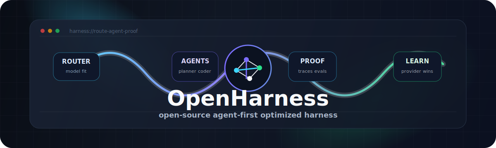

# OpenHarness

<p align="center">
  
</p>

<p align="center">
  <strong>A source-available, agent-first, optimized harness for routing models, running agents, inspecting proof, and learning which providers perform best.</strong>
</p>

OpenHarness is an agent-first desktop harness for people who work across multiple AI models, providers, tools, and coding agents. It keeps chat as the home base while surfacing model routing, provider health, MCP tools, agent traces, eval feedback, and review evidence only when that context helps the work in front of you.

> **Source-available public preview:** OpenHarness is being built in public for feedback, discussion, and evaluation. It is not open-source licensed yet. Please do not fork for redistribution, repackage, offer as a hosted service, or use the code commercially without written permission. See [LICENSE](LICENSE) and [CONTRIBUTING.md](CONTRIBUTING.md).


<p align="center">
  <em>Workspace view: chat, environment context, agent activity, routing state, tools, and project status in one local window.</em>
</p>

## Why It Exists

Most AI coding tools make the model choice feel invisible: one prompt goes in, one answer comes out, and the routing, fallback, tool behavior, and proof trail are hidden. OpenHarness turns that hidden layer into the product.

OpenHarness is built for:

- Comparing models and providers without constantly rewriting your workflow.
- Assigning different models to different jobs, such as planner, coder, reviewer, reasoner, summarizer, worker, and title generation.
- Watching agent work as structured runs rather than loose chat messages.
- Debugging provider failures, tool failures, retries, and fallback decisions.
- Capturing evidence so routing can improve from real outcomes instead of guesswork.
- Keeping the harness open, agent-first, and optimized for provider choice without hiding the proof trail.

## What Makes It Different

| Difference | What it gives you |
| --- | --- |
| **Transparent routing** | Auto-Router scores configured candidates for each task, applies cost and capability gates, and records why a model was selected. |
| **Role-aware agents** | Planner, coder, reviewer, reasoner, summarizer, worker, and title roles can each use different models and model-family prompt strategies. |
| **Visible run traces** | Active work exposes phase state, selected model, provider, tool calls, final-answer proof, replay artifacts, and recovery paths. |
| **Goal loop supervision** | `/goal` turns long-running objectives into durable session context with criteria, evidence, blockers, progress, and guarded completion. |
| **Just-in-time workspace chrome** | Active work, environment context, status, and run detail are docked or collapsed until they add value, keeping the main workspace closer to a calm Codex-style command center. |
| **Provider failure handling** | Transient overloads, auth problems, missing models, and rate-limit-style failures are treated as runtime events that can be surfaced, retried, or routed around. |
| **Vision fallback evidence** | Browser screenshots can be converted into bounded text evidence for models that do not accept native image input. |
| **Tool reliability memory** | Tool-error recovery evidence is recorded so the harness can learn which model/tool/provider combinations recover cleanly. |
| **Model trust surfaces** | Model Lab, Routing Learning, Auto-Router settings, eval proof, prompt strategies, tool reliability, budgets, and provider rate limits are first-class UI surfaces. |
| **Compact agent badges** | Agent roles render as short famous-programmer ID badges such as `ADA`, `RITCHIE`, `HOPPER`, `KNUTH`, and `DIJKSTRA` for dense, scannable run lists. |
| **Local-first desktop state** | Provider config, sessions, routing ledgers, and runtime state live locally rather than in a hosted control plane. |

## Screenshots

### Agent Detail

Agent detail turns a run into an inspectable work object. You can review role, model, provider, status, final-answer proof, tool calls, context files, isolated worktrees, steering events, and replay artifacts without losing the main conversation.


### Auto-Router Evidence

Auto-Router uses a classifier model to choose from active candidates, then layers in candidate cards, eval proof trust, tool-error evidence, freshness checks, thresholds, and effective-cost preferences.


## Core Capabilities

| Capability | Why it matters |
| --- | --- |
| **Auto-Router** | Chooses a model per task from configured candidates instead of forcing every request through one default model. |
| **Agent Roles** | Assigns specialized models to coder, reviewer, planner, reasoner, summarizer, worker, and title generation roles. |
| **Session Goal Loop** | Keeps `/goal` objectives active across turns, injects them into routing and prompts, records run evidence, surfaces progress in chat, and refuses premature completion when proof is missing. |
| **Provider Hub** | Manages hosted and local providers, model fetching, enabled models, active model selection, health checks, budgets, and rate limits. |
| **Live Orchestration** | Surfaces route decisions, agent phases, model requests, tool calls, recovery, and final-answer proof while work is happening. |
| **Browser Visual Evidence** | Captures browser screenshot context as DOM text, headings, controls, image alt text, resource issues, and capture notes so non-vision models still receive usable evidence. |
| **MCP Tooling** | Connects Docker MCP tools, curated tools, custom servers, trust-mode filtering, and tool readiness checks. |
| **Model Library** | Presents model cards with strengths, weaknesses, context limits, provider availability, role fit, and routing hints. |
| **Model Lab** | Runs prompt suites across model sets and produces recommendations that can inform role defaults and router candidates. |
| **Routing Learning** | Tracks prompt strategy evidence, tool reliability, recovery paths, eval proof status, and source-tagged routing recommendations. |
| **Review Surfaces** | Keeps artifacts, patch review, validation evidence, confidence signals, and next actions inspectable without crowding the main answer. |
| **Desktop Shell** | Runs as a Vite web app or the canonical Electron desktop app for local workflows. |

## Typical Workflow

1. Add providers and test connectivity.
2. Fetch provider models and enable the ones you want available.
3. Assign defaults for chat and role-specific agent work.
4. Configure Auto-Router candidates, capability cards, thresholds, and cost preferences.
5. Optionally start a durable objective with `/goal <objective>` or a multiline criteria list.
6. Ask for direct answers, investigation, execution, review, or comparison.
7. Watch active agents, goal progress, traces, provider behavior, and proof as the answer is assembled.
8. Feed outcomes back through Model Lab, Routing Learning, and tool reliability evidence.

## Quick Start

```bash
npm install
npm run dev:all
```

Open [http://localhost:5173](http://localhost:5173). The API server runs on [http://localhost:3001](http://localhost:3001).

You can also run the two processes separately:

```bash
npm run server
npm run dev
```

For the Electron shell:

```bash
npm run electron
```

Electron is the V1 desktop release surface. The Swift/WKWebView prototype under `OpenHarnessApp/` is retained only as a native-shell experiment and regression fixture unless a future plan explicitly reactivates it; see [Desktop Surface Decision](docs/DESKTOP_SURFACE_DECISION.md).

## Configuration

OpenHarness reads provider and runtime settings from `~/.openharness/config.json` and environment variables loaded through `dotenv`.

Provider presets currently cover OpenAI-compatible services and local runtimes, including OpenAI, Anthropic, Google, MiniMax, DeepSeek, xAI, Mistral, Z.AI, Moonshot, Alibaba Qwen, OpenRouter, Ollama, and LM Studio. Most hosted providers use the OpenAI-compatible chat completions shape; Anthropic and Google use dedicated adapters.

Recommended setup path:

1. Open Settings.
2. Add or test providers.
3. Fetch provider models and enable the models you want available.
4. Use **Active Model** for the default chat model.
5. Use **Agent Roles** for role-specific model assignments.
6. Use **Auto-Router** when you want task-level model selection.
7. Use **Routing Learning** and **Model Lab** to inspect evidence and tune candidates over time.

When the active model is **Auto**, the bottom status-bar Router control opens directly to **Settings → Auto-Router** so candidate tuning is one click away.

OpenAI note: ChatGPT subscription labels are planning metadata only. OpenAI API model calls still require OpenAI Platform API credentials.

## Routing Architecture

OpenHarness has two routing layers:

- **Heuristic Router**: classifies a message into `direct`, `investigate`, `execute`, or `compare` mode, plus an agent role and complexity.
- **Auto-Router**: scores configured candidate models against the task signal, then chooses the lowest-cost viable model above the quality threshold.

`server/orchestrator.ts` owns orchestration behavior. It coordinates research, execution, review, comparison, and synthesis paths while the server records trace events for the UI.

When a task includes browser screenshot context, the router treats it as image-aware. If the selected model does not support native vision input, OpenHarness appends a sanitized visual-evidence summary to the model-facing prompt instead of sending raw image data.

Active session goals are part of routing context too. Follow-up requests such as "continue" or "finish the next item" are routed with the current `/goal` objective, criteria, recent evidence, and blockers instead of being classified from the short message alone.

## Goal Loop

Use `/goal` to keep a larger objective alive across chat turns:

```text
/goal Ship the routing cleanup
- Update router context
- Verify the UI surface
- Run lint and build
```

The active goal is stored with the session, shown above the chat composer, and appended to model prompts and Auto-Router task signals. Completed runs add evidence; failed runs add blockers. `/goal status` prints the current objective, criteria, evidence, and blockers. `/goal done` only completes when the recorded criteria and evidence support completion.

## Model Intelligence

The model knowledge base lives in [src/data/modelCatalog.ts](src/data/modelCatalog.ts). It powers the Model Library, hover descriptions, routing hints, model categories, provider availability, and model-card UI.

Related references:

- [docs/MODEL_PROMPTING_GUIDE.md](docs/MODEL_PROMPTING_GUIDE.md): model-family prompting behavior and system prompt strategy.
- [docs/MODEL_LANDSCAPE.md](docs/MODEL_LANDSCAPE.md): model catalog snapshot, role recommendations, providers, and pricing notes.
- [docs/PREMIER_HARNESS_KICKOFF.md](docs/PREMIER_HARNESS_KICKOFF.md): current product overhaul direction.
- [AGENTS.md](AGENTS.md): project rules, routing architecture, validation expectations, and engineering constraints.

## Project Layout

```text
OpenHarness
|-- src/                  React UI, panels, settings, model catalog, themes
|-- server/               Express API, provider adapters, orchestration, routing
|-- electron/             Desktop shell entry points
|-- docs/                 model, routing, planning, screenshots, proof notes
|-- scripts/              smoke tests, hardening checks, startup helpers
`-- public/               static assets, including the OpenHarness icon
```

## Validation

Run the standard checks before committing changes:

```bash
npm run lint
npm run build
```

Useful targeted checks:

```bash
npm run test:prompt-routing-memory
npm run test:tool-reliability
npm run test:theme-accessibility
npm run smoke:tool-boundaries
npm run smoke:docker-ui
npm run smoke:ui-clicks
```

For runtime sanity:

```bash
curl http://127.0.0.1:3001/api/router/state
```

If server/runtime code changes, restart the running OpenHarness server before validating. For README, asset, client-only, and documentation changes, a browser refresh is enough.

## 1. Privacy-Safe Training Data Review

OpenHarness includes a review path for training-data contributions without asking maintainers to ingest private prompts by default. The repository includes a GitHub issue template for proposed datasets, eval examples, routing examples, model-behavior notes, and tool-use traces, plus a required provenance and permission statement.

The in-app Routing Learning export for tool failures is intentionally narrow: it captures failure messages, model identifiers, called tools, recovery outcomes, and the workaround that completed the task. It does not export raw prompts, assistant replies, session titles, artifacts, file contents, raw tool I/O, full traces, session IDs, or run IDs.

See [docs/TRAINING_DATA_SUBMISSIONS.md](docs/TRAINING_DATA_SUBMISSIONS.md) for the submission template and review expectations.

## 2. Local Personalization And Privacy Controls

OpenHarness can store response preferences locally in an encrypted personalization profile under `~/.openharness`. The profile is meant for user-controlled details such as response style, likes, dislikes, workflow preferences, prompting habits, model preferences, tool preferences, project preferences, and "never do" rules.

Personalization is opt-in from **Settings -> Assistant -> Personalization**. When enabled, the profile is summarized into model prompts so responses can better match the user's workflow. The profile stays local unless the user chooses to share or export it outside OpenHarness.

## 3. Release Notes, Crash Reports, And Setup

After an update, OpenHarness can show a quiet release-note banner once on first launch. Users can opt out of automatic release-note banners, and all release notes remain available later in **Settings -> Release Notes**.

Crash reporting is local and user-driven. **Settings -> Crash Reports** shows local crash/log sources, recent crash-related files, and an export button for a redacted JSON report. Reports are not uploaded automatically; Crashpad/minidump content is listed as metadata only, and text excerpts are limited to redacted error/crash lines.

The setup wizard defaults to system appearance, with dark mode as the safe fallback if the OS preference cannot be read. Users can rerun the wizard from **Settings -> Setup Wizard**, switch to light mode if they want, and choose generated shell textures such as soft marble, brushed plaster, paper fiber, and frosted noise from **Settings -> Theme**. The existing texture slider adjusts the selected texture intensity.

## Packaging

Current prerelease: `1.0.0-alpha.update.4`.

```bash
npm run pack
npm run dist
npm run dist:all
npm run dist:mac:notarized
npm run dist:mac:notarized:local
```

Build output is written to `release/`. The web build output is written to `dist/`.

Packaged desktop builds check GitHub Releases for updates. Release builds should
publish the platform artifacts plus Electron Builder update metadata:

- macOS: `.dmg`, `.zip`, `latest-mac.yml`, and blockmaps
- Windows: NSIS `.exe`, `.zip`, `latest.yml`, and blockmaps
- Linux: AppImage, `.tar.gz`, and `latest-linux.yml`

Use **Check for Updates...** from the app menu to manually verify the update
channel from a stable installed app artifact.

For notarized macOS release builds, use `npm run dist:mac:notarized`. On this
machine, the notarization credential is stored as the `openharness-notary`
keychain profile, so `npm run dist:mac:notarized:local` runs the local notarized
build directly. Setup notes and Apple credential links are in
[docs/MACOS_NOTARIZATION.md](docs/MACOS_NOTARIZATION.md).

## Tech Stack

- React 19 and TypeScript
- Vite
- Express
- Electron
- Lucide React
- Markdown rendering with syntax highlighting
- MCP server integrations

## Build In Public

OpenHarness is public so people can follow the work, try it locally, open issues, and discuss direction. The repo is source-available rather than open-source licensed while the product is still taking shape.

Feedback is welcome through GitHub Issues and Discussions. Contributions are governed by [CONTRIBUTING.md](CONTRIBUTING.md).

Training data, including datasets, prompt examples, eval examples, routing
examples, model-behavior examples, and tool-use traces, can be submitted for
review through the training data submission issue form. See
[docs/TRAINING_DATA_SUBMISSIONS.md](docs/TRAINING_DATA_SUBMISSIONS.md) for the
required template, provenance notes, and permission statement.

## License

OpenHarness is currently source-available, not open-source licensed. All rights are reserved unless explicit written permission is granted. See [LICENSE](LICENSE).
